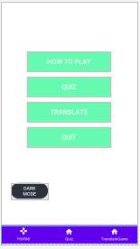
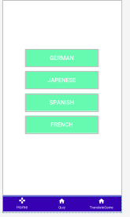
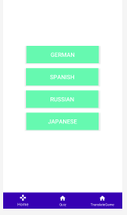
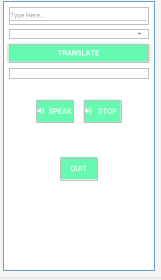
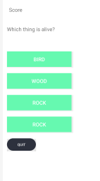
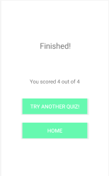

# MobileAssignment

 

This image shows my applications main screen, on this screen I display a "How to play" button which displays an alert dialog telling a user what to do on my application, a "Quiz" button which when clicked takes the user to the quiz selection screen, a "Translate" button which when clicked takes a user to the translate game screen,a "Quit" button which will display a alert dialog asking the user if they would like to quit the application and a "Dark Mode" button which when clicked toggles between the applications dark and light mode.

 

On the translate game activity it displays 4 seperate buttons which take the user to a different translate game for each of the four displayed languages

 

In the quiz selection activity it displays 4 seperate buttons which take the user to a different quiz game upon clicking the buttons

 
 
 
 
 
