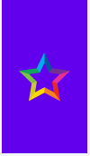

# MobileAssignment

 

This image shows my applications main screen, on this screen I display a "How to play" button which displays an alert dialog telling a user what to do on my application, a "Quiz" button which when clicked takes the user to the quiz selection screen, a "Translate" button which when clicked takes a user to the translate game screen,a "Quit" button which will display a alert dialog asking the user if they would like to quit the application and a "Dark Mode" button which when clicked toggles between the applications dark and light mode. There also shows a bottom navigation on the bottom navigation are 3 different buttons to be clicked, one button takes the user to the Home Page, one button takes the user to the Quiz page and the last button takes the user to the Translate Game page, this bottom navigation is on the main, translate game selection and quiz selection activities.

 

On the translate game activity it displays 4 seperate buttons which take the user to a different translate game for each of the four displayed languages

 

In the quiz selection activity it displays 4 seperate buttons which take the user to a different quiz game upon clicking the buttons

 

Splash screen shows a image which has implemeted a transition animation, the animation causes the image to spin around in a 360degress and then spin back in a 360degrees.

 

The German translate activity is the exact same as the other language translate activities, i originally wanted to create just the one activity for each of the languages however i ran into some problems when trying to include the text-to-speech translation code which had to change for when a different language was selected from the spinner. This would have meant 3 less activities which would have been best practises for my application. I used the styling from Grayson's language-translator for the text-to-text translation as i had problems implementing this code so to keep it simple i kept the styling the same with the added text-to-speech start and stop buttons. Weirdly the Quit button only works once the translate button has been clicked. I feel there was a relatively easy fix for this but as i was running out of time i kept it as it was. 

 

The Quiz pages show a score a question and 5 working buttons. I used 4 different activities for each of the quiz selection languages which are all identical apart from the questions and different options available. I failed to implement an image for each of the different quiz questions as I was beginning to run out of time and had already spent a long amount of time on this. 

 

Results page shows what score the user got in the quiz using the getExtras to give the score from the previous activity to this activity. Also showed is a try another quiz which takes the user back to the quiz selection page and a home button which takes the user back to the home screen.

 

This shows a custom progress display which i used from graysons code, i originally wanted to change this and implement my own custom progress dialog but i felt like i was running out of time to get the application finished so i had to leave it the same as graysons.

